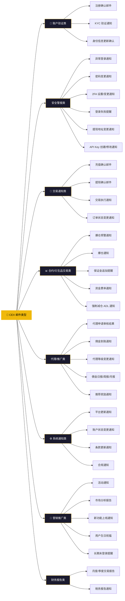
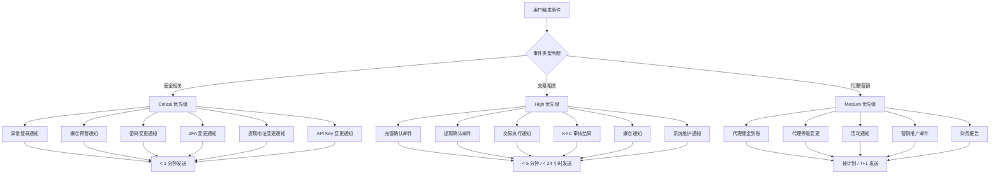
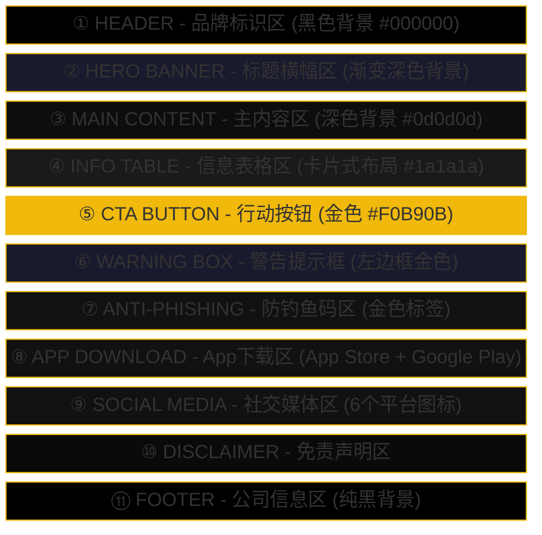
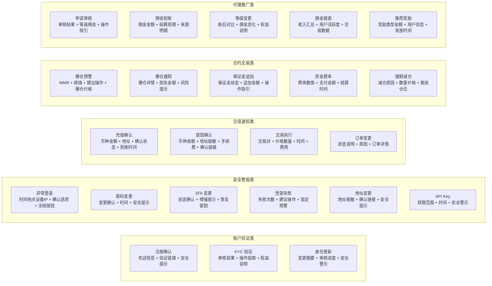
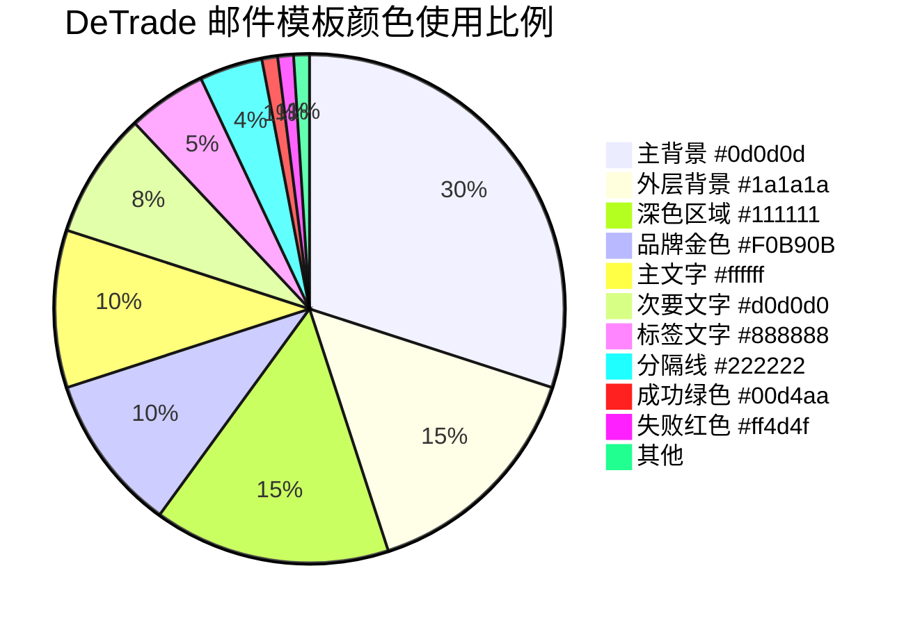
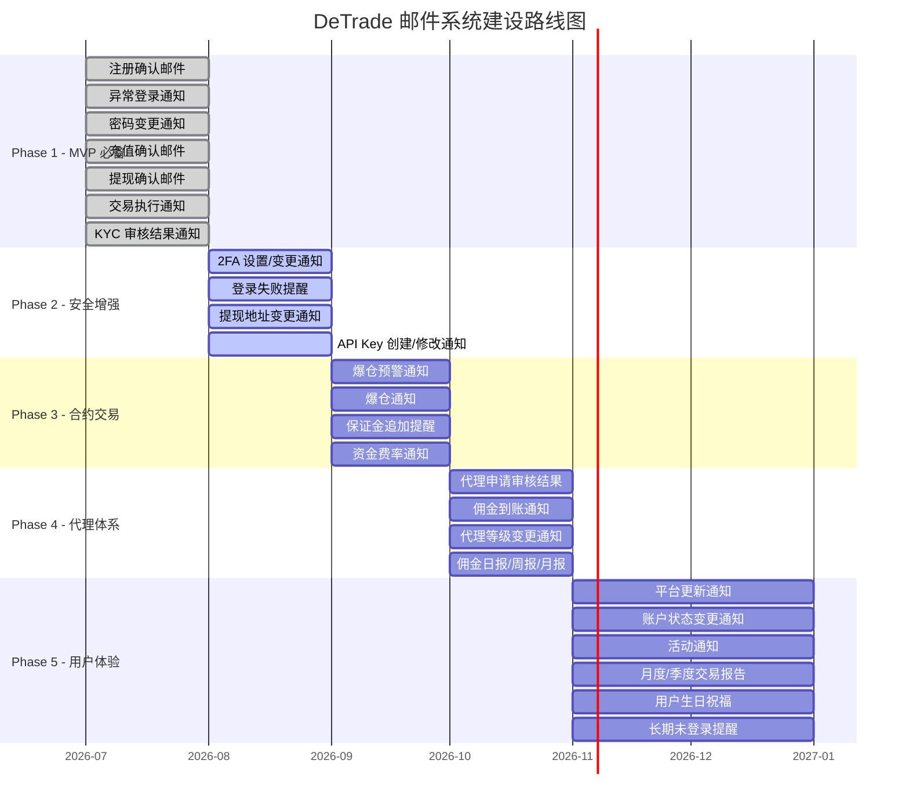

# CEX 交易所邮件类型与模板 - Mermaid 可视化

## 1. 邮件类型分类总览（思维导图）

```mermaid
graph LR
    root["📧 CEX 邮件类型"]

    root --> A["🔐 账户验证类"]
    root --> B["️ 安全警报类"]
    root --> C["💱 交易通知类"]
    root --> D["📊 合约/衍生品交易类"]
    root --> E[" 代理/推广类"]
    root --> F["⚙️ 系统通知类"]
    root --> G["📢 营销推广类"]
    root --> H[" 财务报告类"]

    A --> A1["注册确认邮件"]
    A --> A2["KYC 验证通知"]
    A --> A3["身份信息更新确认"]

    B --> B1["异常登录通知"]
    B --> B2["密码变更通知"]
    B --> B3["2FA 设置/变更通知"]
    B --> B4["登录失败提醒"]
    B --> B5["提现地址变更通知"]
    B --> B6["API Key 创建/修改通知"]

    C --> C1["充值确认邮件"]
    C --> C2["提现确认邮件"]
    C --> C3["交易执行通知"]
    C --> C4["订单状态变更通知"]

    D --> D1["爆仓预警通知"]
    D --> D2["爆仓通知"]
    D --> D3["保证金追加提醒"]
    D --> D4["资金费率通知"]
    D --> D5["强制减仓 ADL 通知"]

    E --> E1["代理申请审核结果"]
    E --> E2["佣金到账通知"]
    E --> E3["代理等级变更通知"]
    E --> E4["佣金日报/周报/月报"]
    E --> E5["推荐奖励通知"]

    F --> F1["平台更新通知"]
    F --> F2["账户状态变更通知"]
    F --> F3["条款更新通知"]
    F --> F4["合规通知"]

    G --> G1["活动通知"]
    G --> G2["市场分析报告"]
    G --> G3["新功能上线通知"]
    G --> G4["用户生日祝福"]
    G --> G5["长期未登录提醒"]

    H --> H1["月度/季度交易报告"]
    H --> H2["税务报告通知"]

    style root fill:#F0B90B,color:#000000,stroke:#F0B90B,stroke-width:2px
    style A fill:#1a1a2e,color:#ffffff,stroke:#F0B90B
    style B fill:#1a1a2e,color:#ffffff,stroke:#F0B90B
    style C fill:#1a1a2e,color:#ffffff,stroke:#F0B90B
    style D fill:#1a1a2e,color:#ffffff,stroke:#F0B90B
    style E fill:#1a1a2e,color:#ffffff,stroke:#F0B90B
    style F fill:#1a1a2e,color:#ffffff,stroke:#F0B90B
    style G fill:#1a1a2e,color:#ffffff,stroke:#F0B90B
    style H fill:#1a1a2e,color:#ffffff,stroke:#F0B90B
```

## 2. 邮件发送优先级流程

```mermaid
flowchart TD
    A[用户触发事件] --> B{事件类型判断}

    B -->|安全相关| C[Critical 优先级]
    B -->|交易相关| D[High 优先级]
    B -->|代理/营销| E[Medium 优先级]

    C --> C1[异常登录通知]
    C --> C2[爆仓预警通知]
    C --> C3[密码变更通知]
    C --> C4[2FA 变更通知]
    C --> C5[提现地址变更通知]
    C --> C6[API Key 变更通知]

    D --> D1[充值确认邮件]
    D --> D2[提现确认邮件]
    D --> D3[交易执行通知]
    D --> D4[KYC 审核结果]
    D --> D5[爆仓通知]
    D --> D6[系统维护通知]

    E --> E1[代理佣金到账]
    E --> E2[代理等级变更]
    E --> E3[活动通知]
    E --> E4[营销推广邮件]
    E --> E5[财务报告]

    C1 & C2 & C3 & C4 & C5 & C6 --> F["< 1 分钟发送"]
    D1 & D2 & D3 & D4 & D5 & D6 --> G["< 5 分钟 / < 24 小时发送"]
    E1 & E2 & E3 & E4 & E5 --> H["按计划 / T+1 发送"]
```

## 3. 邮件模板布局结构

```mermaid
block-beta
    columns 1
    header["① HEADER - 品牌标识区 (黑色背景 #000000)"]
    hero["② HERO BANNER - 标题横幅区 (渐变深色背景)"]
    content["③ MAIN CONTENT - 主内容区 (深色背景 #0d0d0d)"]
    info["④ INFO TABLE - 信息表格区 (卡片式布局 #1a1a1a)"]
    cta["⑤ CTA BUTTON - 行动按钮 (金色 #F0B90B)"]
    warning["⑥ WARNING BOX - 警告提示框 (左边框金色)"]
    phishing["⑦ ANTI-PHISHING - 防钓鱼码区 (金色标签)"]
    app["⑧ APP DOWNLOAD - App下载区 (App Store + Google Play)"]
    social["⑨ SOCIAL MEDIA - 社交媒体区 (6个平台图标)"]
    disclaimer["⑩ DISCLAIMER - 免责声明区"]
    footer["⑪ FOOTER - 公司信息区 (纯黑背景)"]

    style header fill:#000000,color:#ffffff,stroke:#F0B90B
    style hero fill:#1a1a2e,color:#ffffff,stroke:#F0B90B
    style content fill:#0d0d0d,color:#d0d0d0,stroke:#F0B90B
    style info fill:#1a1a1a,color:#ffffff,stroke:#F0B90B
    style cta fill:#F0B90B,color:#000000,stroke:#F0B90B
    style warning fill:#1a1a2e,color:#b0b0b0,stroke:#F0B90B
    style phishing fill:#111111,color:#F0B90B,stroke:#F0B90B
    style app fill:#111111,color:#ffffff,stroke:#F0B90B
    style social fill:#111111,color:#F0B90B,stroke:#F0B90B
    style disclaimer fill:#0a0a0a,color:#666666,stroke:#F0B90B
    style footer fill:#000000,color:#555555,stroke:#F0B90B
```

## 4. 各邮件类型内容要素

```mermaid
flowchart LR
    subgraph 账户验证类
        A1["注册确认\n欢迎信息 + 验证链接 + 安全提示"]
        A2["KYC 验证\n审核结果 + 操作指南 + 权益说明"]
        A3["身份更新\n变更摘要 + 审核进度 + 安全警示"]
    end

    subgraph 安全警报类
        B1["异常登录\n时间地点设备IP + 确认选项 + 冻结按钮"]
        B2["密码变更\n变更确认 + 时间 + 安全提示"]
        B3["2FA 变更\n状态确认 + 增强提示 + 恢复密钥"]
        B4["登录失败\n失败次数 + 建议操作 + 锁定预警"]
        B5["地址变更\n地址脱敏 + 确认链接 + 安全提示"]
        B6["API Key\n权限范围 + 时间 + 安全警示"]
    end

    subgraph 交易通知类
        C1["充值确认\n币种金额 + 地址 + 确认状态 + 到账时间"]
        C2["提现确认\n币种金额 + 地址脱敏 + 手续费 + 确认链接"]
        C3["交易执行\n交易对 + 价格数量 + 时间 + 费用"]
        C4["订单变更\n状态说明 + 原因 + 订单详情"]
    end

    subgraph 合约交易类
        D1["爆仓预警\nMMR + 阈值 + 建议操作 + 爆仓价格"]
        D2["爆仓通知\n爆仓详情 + 损失金额 + 风险提示"]
        D3["保证金追加\n保证金状态 + 追加金额 + 操作指引"]
        D4["资金费率\n费率数值 + 支付金额 + 结算时间"]
        D5["强制减仓\n减仓原因 + 数量价格 + 剩余仓位"]
    end

    subgraph 代理推广类
        E1["申请审核\n审核结果 + 等级佣金 + 操作指引"]
        E2["佣金到账\n佣金金额 + 结算周期 + 来源明细"]
        E3["等级变更\n新旧对比 + 佣金变化 + 权益说明"]
        E4["佣金报表\n收入汇总 + 用户活跃度 + 交易数据"]
        E5["推荐奖励\n奖励类型金额 + 用户信息 + 发放时间"]
    end
```

## 5. 邮件模板颜色系统

```mermaid
pie title DeTrade 邮件模板颜色使用比例
    "主背景 #0d0d0d" : 30
    "外层背景 #1a1a1a" : 15
    "深色区域 #111111" : 15
    "品牌金色 #F0B90B" : 10
    "主文字 #ffffff" : 10
    "次要文字 #d0d0d0" : 8
    "标签文字 #888888" : 5
    "分隔线 #222222" : 4
    "成功绿色 #00d4aa" : 1
    "失败红色 #ff4d4f" : 1
    "其他" : 1
```

## 6. 邮件实施优先级路线图

```mermaid
gantt
    title DeTrade 邮件系统建设路线图
    dateFormat  YYYY-MM
    axisFormat  %Y-%m

    section Phase 1 - MVP 必备
    注册确认邮件           :done, p1a, 2026-07, 1M
    异常登录通知           :done, p1b, 2026-07, 1M
    密码变更通知           :done, p1c, 2026-07, 1M
    充值确认邮件           :done, p1d, 2026-07, 1M
    提现确认邮件           :done, p1e, 2026-07, 1M
    交易执行通知           :done, p1f, 2026-07, 1M
    KYC 审核结果通知       :done, p1g, 2026-07, 1M

    section Phase 2 - 安全增强
    2FA 设置/变更通知      :active, p2a, 2026-08, 1M
    登录失败提醒           :active, p2b, 2026-08, 1M
    提现地址变更通知       :active, p2c, 2026-08, 1M
    API Key 创建/修改通知  :active, p2d, 2026-08, 1M

    section Phase 3 - 合约交易
    爆仓预警通知           :p3a, 2026-09, 1M
    爆仓通知               :p3b, 2026-09, 1M
    保证金追加提醒         :p3c, 2026-09, 1M
    资金费率通知           :p3d, 2026-09, 1M

    section Phase 4 - 代理体系
    代理申请审核结果       :p4a, 2026-10, 1M
    佣金到账通知           :p4b, 2026-10, 1M
    代理等级变更通知       :p4c, 2026-10, 1M
    佣金日报/周报/月报     :p4d, 2026-10, 1M

    section Phase 5 - 用户体验
    平台更新通知           :p5a, 2026-11, 2M
    账户状态变更通知       :p5b, 2026-11, 2M
    活动通知               :p5c, 2026-11, 2M
    月度/季度交易报告      :p5d, 2026-11, 2M
    用户生日祝福           :p5e, 2026-11, 2M
    长期未登录提醒         :p5f, 2026-11, 2M
```

## 7. 邮件类型与区域使用矩阵

```mermaid
flowchart TB
    subgraph 区域组件
        H[Header 品牌标识]
        He[Hero Banner 标题横幅]
        C[Main Content 主内容]
        T[Info Table 信息表格]
        B[CTA Button 行动按钮]
        W[Warning Box 警告框]
        P[Anti-Phishing 防钓鱼码]
        A[App Download 下载区]
        S[Social Media 社交媒体]
        D[Disclaimer 免责声明]
        F[Footer 公司信息]
    end

    subgraph 邮件类型
        M1[注册确认] --> H & C & B & P & A & S & D & F
        M2[安全警报] --> H & C & T & B & W & P & A & S & D & F
        M3[充值确认] --> H & C & T & P & A & S & D & F
        M4[提现确认] --> H & C & T & B & W & P & A & S & D & F
        M5[爆仓预警] --> H & C & T & B & W & P & A & S & D & F
        M6[爆仓通知] --> H & C & T & B & P & A & S & D & F
        M7[KYC审核] --> H & C & B & P & A & S & D & F
        M8[代理佣金] --> H & C & T & B & P & A & S & D & F
        M9[活动营销] --> H & He & C & B & P & A & S & D & F
        M10[平台维护] --> H & C & P & A & S & D & F
    end
```
